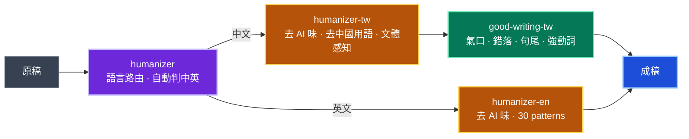

# writing-skills.TW


> 給 Claude Code 的繁體中文（台灣）寫作工具鏈：**去 AI 味 → 琢磨節奏 → 用寓言學概念**。

六支 skill，可串接成完整工作流，也可各自獨立用。主打台灣中文寫作場景（中國用語滲入、AI 寫作痕跡、技術文件不能亂改、用寓言學新領域），並附英文去 AI 味的 humanizer-en（fork 自 blader/humanizer）與 `/humanizer` 語言路由入口（自動判中英）——一次安裝，中英雙語都能去 AI 味。

---

## 工作流



從 `humanizer` 路由入口進，自動判語言：**中文**走 `humanizer-tw` 去 AI 味，再接 `good-writing-tw` 琢磨節奏；**英文**走 `humanizer-en`（30 patterns）。`good-writing-tw` 是中文節奏琢磨、只在中文線，英文到 `humanizer-en` 即完成。

> `fable-econ`／`fable-explore` 不在這條串接流程裡——它們是另一種獨立用途：從零用寓言學新概念（見下方專節）。

---

## Hero：humanizer-tw 改寫前後

下面是一段你會在 LLM 倒出的中文裡看到的典型開頭——時代開場 + 連接詞 + 互聯網黑話 + 結尾套話樣樣有。

**改寫前：**

> 隨著人工智慧技術的快速發展，越來越多的企業開始採用 AI 解決方案。我們聚焦用戶痛點，通過深耕垂直賽道，打通上下游產業鏈，實現了業務閉環。這一舉措不僅賦能了合作夥伴，更為整個生態圈注入了新的活力。讓我們攜手共進，共創美好未來！

**改寫後：**

> 現在很多公司在用 AI。我們專注解決用戶問題，在這個領域做了三年。把供應商和客戶都串起來，從頭到尾都能自己做。合作夥伴也跟著賺錢。專案下個月上線，目標每日 5000 活躍使用者。

對照 humanizer-tw 抓到的問題：

| 病徵 | 範例詞 | 改寫策略 |
|---|---|---|
| 時代開場 | 「隨著⋯⋯的發展」 | 直接刪 |
| 連接詞濫用 | 「此外」「不僅⋯⋯更為」 | 大量刪減 |
| 互聯網黑話 | 賦能、痛點、閉環、賦能、深耕、賽道 | 換日常詞 |
| 結尾套話 | 「攜手共進，共創美好未來」 | 換具體目標 |
| 中式 AI 句型 | 「實現了業務閉環」 | 用動詞表達 |

整套規則來自 [humanizer-tw](humanizer-tw/SKILL.md)。

---

## 六支 skill

| Skill | 角色 | 何時用 | 來源 |
|---|---|---|---|
| **[humanizer](humanizer/)** | 語言路由入口 | 打 `/humanizer`、不想指定語言、或中英混合——自動判語言轉到 -tw / -en | 本 repo |
| **[humanizer-tw](humanizer-tw/)** | 去 AI 味（中文） | 處理 LLM 倒出的中文 / 已 OpenCC `s2twp` 轉過的簡中翻譯 | 原創（[yelban/humanizer.tw](https://github.com/yelban/humanizer.tw)） |
| **[humanizer-en](humanizer-en/)** | 去 AI 味（英文） | 處理英文 AI 生成文字（30 patterns、voice calibration） | fork 自 [blader/humanizer](https://github.com/blader/humanizer)（synced v2.7.0） |
| **[good-writing-tw](good-writing-tw/)** | 琢磨節奏 | 已經乾淨但讀起來悶 / 想提升文筆 / 技術文件保守潤飾 | 整合 Paul Graham + 余光中 + 王鼎鈞 |
| **[fable-econ](fable-econ/)** | 寓言生成（經濟學） | 想用 Amanda Askell 原版 prompt 學經濟學概念 | [Amanda Askell, 2025.3 X 貼文](https://x.com/AmandaAskell/status/1898862564718923837) |
| **[fable-explore](fable-explore/)** | 寓言生成（任何領域） | 跨領域學概念、可調難度（國小～專家）／風格／模式 | [Amanda Askell, 2026.4 Newcomer Pod 訪談](https://www.youtube.com/watch?v=0GaKJ4Fp2x4) |

---

## humanizer-tw — 去 AI 味

**罕見設計：**

- **文體感知開關**：正式文體（公文、技術文件、財報）只跑 4 條核心規則，停用「個性注入」「書面語口語化」；非正式（部落格、社群、散文）全開。同一支 skill 兩種強度
- **OpenCC 漏網層**：處理「已 `opencc s2twp` 轉過的繁中再清一次」——fork 簡中 repo、翻 GitHub 文件這類場景。連 OpenCC 詞典沒收的「聚類→分群、構建→建構、鏈路→流程、PyPI 包→套件、命令→指令（CLI 語境）」都列出
- **三段輸出協議**：`<diagnosis>` 先分類所有問題、`<rewrite>` 改寫、`<changelog>` 條列變更——強迫先看清再下手
- **200+ 詞彙對照**：互聯網黑話、中國用語、書面語、絕對詞軟化全部列表化
- **個人風格校準（opt-in）**：提供自己的舊文當樣本，改寫時對齊你的句長、用詞、標點習慣——成品像你寫的，不是通用 AI 腔
- **標註模式**：只想知道「哪裡像 AI」時，輸出問題清單（問題族／觸發點／建議動作／是否建議改寫）不改稿
- **看 cluster 不看單點**：偵測指南防誤殺——單一破折號或正式詞不算 AI，要徵兆叢集才動手；密度閾值（短段 2+／長段 3+）避免過度矯正

**13 類 AI 寫作痕跡**：開場白與連接詞、互聯網黑話、翻譯腔、書面語過重、公式化結構、結尾套話、語氣問題、中式 AI 句型、中國用語滲入、OpenCC 漏網、無源權威歸因、新世代 LLM 口癖、結構與修辭 tell（假深刻語／開場宣告／假範圍／diff-anchored…）。

**觸發詞：**
```
/humanizer                    ← 改寫當前對話的文字
humanize 這段                  ← 自然語言
去除 AI 痕跡 / 人性化 / 去機器味
這段哪裡像 AI（先別改）        ← 標註模式：只列問題不改稿
文風參考我這篇：<舊文/檔案>    ← 個人風格校準：改成像你寫的
```

詳細範例見 [`humanizer-tw/references/examples.md`](humanizer-tw/references/examples.md)（13 組前後對比，含三層對照）。新能力細節：[`voice-calibration-zh.md`](humanizer-tw/references/voice-calibration-zh.md)、[`detection-guidance-zh.md`](humanizer-tw/references/detection-guidance-zh.md)。

---

## humanizer-en — 去 AI 味（英文）

處理**英文** AI 生成文字的姊妹技能，fork 自 [blader/humanizer](https://github.com/blader/humanizer)（Siqi Chen，MIT），synced 上游 **v2.7.0**，pattern 內容逐字保留，僅將 `name` 由 `humanizer` 改為 `humanizer-en` 以與 humanizer-tw 對稱。

- **30 條 pattern**：基於 Wikipedia「Signs of AI writing」——inflated symbolism、promotional language、rule of three、em dash overuse、vague attributions、AI vocabulary words…
- **Voice calibration**：提供英文寫作樣本即對齊你的句長、用詞、標點習慣
- **Detection guidance**：what NOT to flag + 看 cluster 不看單點 + 該保留的人類書寫徵兆

**觸發詞：**
```
/humanizer-en                 ← 改寫英文文字
humanize this (English)        ← 自然語言（英文輸入自動路由到這支）
```

完整 pattern 與範例見 [`humanizer-en/SKILL.md`](humanizer-en/SKILL.md)。

---

## good-writing-tw — 琢磨節奏

**理論基底：** Paul Graham〈Good Writing〉「搖晃箱子」+ 余光中「弱動詞包裝病」+ 王鼎鈞「念得出口」。

**節奏規則（可量測）：**

- **氣口**：兩個標點之間連續字數不超過 15–20 字
- **錯落**：相鄰句長差異 > 5 字，避免連續 3 句以上長度相近
- **句尾**：名詞收尾穩、動詞收尾勁、助詞收尾軟——避免連續句尾同類型

**五大改寫技法：**

1. 刪贅字「的」（連續三「的」想法沒整理好）
2. 刪「進行／實施／加以」這類弱動詞包裝
3. 拆長句（單句 > 30 字）
4. 砍開頭填充詞（「關於這個問題」「基本上來說」直接刪）
5. 還原強動詞（「做出改善」→「改善」、「被⋯⋯所⋯⋯」改主動）

**三模式（這是這支 skill 最罕見的部分）：**

| 模式 | 觸發 | 行為 |
|---|---|---|
| 完整 | 改寫散文 | 全規則開啟，輸出 `<diagnosis>` + `<planning>` + `<rewrite>` |
| 自動 | 寫作時 | 規則內建套用，不輸出 CoT 區塊 |
| **保守（conservative）** | **技術文件**：README、API 文件、CLI 說明 | **只跑 4 條核心、停用「錯落／打破公式」、絕對不碰程式碼塊／URL／表格／英文術語** |

保守模式專門避免「把 README 結構化列舉改壞」的問題。連術語連綴例外都列出——副檔名列表「`.py .ts .js .go .rs`」即使字元計數長也不算違規（每個副檔名都是停頓點）。

**前後對比範例：**

```
原句：我們需要對現有流程做出改善。
改寫：我們需要改善現有流程。
（刪「做出」這個包裝）

原句：由於天氣不好加上交通阻塞的關係，所以他沒有辦法準時抵達會場參加會議。
改寫：天氣差，路又塞。他遲到了。
（一句兩個因果拆三句，因果更清晰）
```

**觸發詞：**
```
/good-writing-tw              ← 完整改寫
/潤稿
讓文字更順 / 文筆 / 改寫 / rewrite
技術文件潤飾                  ← 自動切保守模式
conservative 模式
```

完整理論見 [`good-writing-tw/references/guide.md`](good-writing-tw/references/guide.md)（含英文版 [`guide-en.md`](good-writing-tw/docs/guide-en.md)）。

---

## fable-econ + fable-explore — 用寓言學概念

Amanda Askell 在 X 上分享過一個她最愛的提示詞：讓 Claude 從某學科挑一個小眾原理，寫成 3 段故事，最後一段才揭曉原理名稱。她說這些「academic allegories」變成她取代滑社群媒體的健康儀式。

兩個版本：

- **fable-econ**：忠實重現 Amanda 2025.3 原版（鎖定經濟學、嚴格 3+1 結構）
- **fable-explore**：延伸至任何領域、可調難度（國小～專家）、五種模式（批次／互動／選擇題／跨域／指定風格）

**hero 範例：** 兩家麵館的故事（資訊瀑布）

> 午餐時間，台北東區新開了兩家麵館，並排在同一條小巷子裡⋯⋯
>
> 一個月後，老薛每天午餐座無虛席，等位要四十分鐘；阿順隔壁幾乎只有偶爾走錯的外送員進門取餐。其實吃過阿順的人，十個裡有六個覺得湯頭更鮮。老薛的老闆娘問過幾個客人為何選擇她家，十個裡有八個給的答案都是「看這邊人多」。
>
> ---
>
> 這個故事呈現的是**資訊瀑布（informational cascade）**：當人們依序決定、能觀察前人選擇但看不見前人的私有資訊時，從某個節點開始，後來者放棄自己的判斷、完全跟隨前人——反而是理性的。一旦瀑布形成，就算大多數人私下覺得阿順更好，這份偏好也永遠不會浮出水面。

完整輸出見 [`fable-econ/SKILL.md`](fable-econ/SKILL.md) 中的 Oakridge Orchards 範例（Amanda 原版 Alchian-Allen theorem 示範）。

**觸發詞：**
```
/fable-econ                     ← 預設一篇經濟學寓言
/fable-econ 拍賣理論              ← 指定子領域
/fable-explore 拓撲學
/fable-explore 用國小程度教我天文學
/fable-explore -x 熱力學 資訊理論  ← 跨域結構同構
/fable-explore -s 莊子 神經科學    ← 指定文風
"用寓言教我量子力學"
"再一個"                        ← 沿用上輪設定
```

---

## Quick start

需要 [Claude Code](https://claude.com/claude-code) CLI。在 Claude Code 裡執行以下 slash 指令：

```text
# 1. 加入本 marketplace
/plugin marketplace add aeopress/writing-skills.TW

# 2. 一行安裝全部六支 skill
/plugin install writing-skills@writing-skills-tw

# 3. 重啟 Claude Code（或 /reload-plugins），輸入觸發詞
```

六支 skill（humanizer 路由入口、humanizer-tw、humanizer-en、good-writing-tw、fable-econ、fable-explore）打包成單一 plugin，一次安裝完成。

---

## 用法教學（端到端）

安裝後直接在對話裡用自然語言或 slash 觸發。下面每個情境給「你說什麼 → 會發生什麼」。

### 情境 1：清掉 LLM 倒出的中文稿
最常見的用法。把一段 AI 味很重的文字交給它。

> **你說：** `/humanizer` 然後貼上文字，或「幫我去 AI 味：〔貼文字〕」
> **會發生：** 輸出三段——`<diagnosis>`（按類別列出抓到的 AI 痕跡）、`<rewrite>`（改寫稿）、`<changelog>`（變更摘要）。文體自動判斷：部落格全規則開，公文只去毒、不口語化。
>
> **中英自動分流：** 三種叫法都行——① 自然語言「去 AI 味」② `/humanizer`（語言路由入口，自動判中英）③ 直接指定 `/humanizer-tw`（中文：在地化、OpenCC 漏網）或 `/humanizer-en`（英文：Wikipedia 30 patterns）。判語言看「要被改的文字」，不是你下指令的語言。

### 情境 2：fork 簡中專案，清 OpenCC 殘留
翻譯或 fork 簡中 repo 的 README、文件，`opencc s2twp` 轉完還有漏網。

> **你說：** 「這是剛用 OpenCC s2twp 轉過的繁中，幫我抓漏網的中國用語和標點：〔貼文字〕」
> **會發生：** 額外觸發 OpenCC 漏網層——抓詞典沒收的「聚類→分群、構建→建構、命令→指令（CLI 語境）」、半形標點轉全形、動詞誤譯（運行→執行）。

### 情境 3：只想知道哪裡像 AI，先別改
審稿、教學、或還沒決定要不要改時。

> **你說：** 「這段哪裡像 AI？先別改」
> **會發生：** 進標註模式，只列 1–5 個問題點，每點四欄（問題族／觸發點／建議動作／是否建議改寫），不輸出改寫稿。

### 情境 4：改得像「我自己寫的」
不想要通用 AI 腔，要對齊自己的文風。

> **你說：** 「幫我去 AI 味，文風參考我這篇舊文：〔貼樣本〕」或「…參考 `~/blog/old-post.md`」
> **會發生：** 先分析樣本的句長、用詞、標點、口頭禪，改寫時對齊你的聲音。護欄：只借風格，不搬樣本的事實，也不放大樣本的錯字。

### 情境 5：完整工作流（去毒 → 琢磨 → 成稿）
兩支前後串接，這是 repo 的核心設計。

> **你說：**（第一輪）「先用 humanizer-tw 去 AI 味：〔貼文字〕」→（拿到改寫稿後）「再用 good-writing-tw 琢磨節奏」
> **會發生：** humanizer 先清掉套話、黑話、中國用語；good-writing-tw 再處理氣口、句長錯落、強動詞還原。各司其職，不互相覆蓋。

### 情境 6：技術文件保守潤飾
README、API 文件、CLI 說明——只順氣口，不動結構。

> **你說：** 「用 good-writing-tw 保守模式潤飾這份 README」或直接說「技術文件潤飾」
> **會發生：** 只跑 4 條核心（刪三連「的」、刪「進行／加以」、拆超長句、修氣口），停用「錯落／打破公式」，絕對不碰程式碼區塊、URL、表格、英文術語、副檔名列表。

### 情境 7：用寓言學新概念
從零生成，不是改寫。

> **你說：** `/fable-econ 拍賣理論`、`/fable-explore 用國小程度教我天文學`、「用寓言教我量子力學」、跨域 `/fable-explore -x 熱力學 資訊理論`
> **會發生：** 寫一篇故事，最後一段才揭曉概念名稱。fable-econ 嚴格 3+1 結構（限經濟學）；fable-explore 任何領域、可調難度與風格。說「再一個」沿用上輪設定。

---

## 跟其他類似 skill 的差別

寫作類 Claude Code skill 不少。下面是這個 repo 跟最常被搜到的幾支的定位差異：

| 競品 | 跟 writing-skills.TW 的差別 |
|---|---|
| [blader/humanizer](https://github.com/blader/humanizer) | 英文版（Wikipedia "Signs of AI writing" 基礎）。我們處理中國用語滲入 + OpenCC 漏網 + 文體感知 |
| op7418/Humanizer-zh、kevintsai1202/Humanizer-zh-TW、shyuan/writing-humanizer | 同樣處理中文 AI 痕跡，但沒有文體感知開關、沒有 OpenCC 漏網層、沒有與琢磨節奏層的設計串接 |
| obra/superpowers writing-skills | 名字接近但其實是 **skill-authoring 方法論**（教怎麼寫 skill），不是文章潤稿 |
| lguz/humanize-writing-skill | 英文版 3-pass 系統 + 36 banned words |
| MCPMarket Paul Graham Style Essayist | 英文 PG 風格產生器，我們是中文改寫 + 余光中／王鼎鈞 |
| IrtezaAsadRizvi/article-writing-skills | 風格化寫作集，沒處理 AI 痕跡這層 |

**在「中文（台灣繁中）+ 三層串接工作流（去毒→琢磨→生成）」這個交集上，這個 repo 幾乎沒有同類。加上技術文件保守模式與 OpenCC 漏網清理層，更難找到對位的競品。**

---

## 來源致謝

- **humanizer-tw** 原創於 [yelban/humanizer.tw](https://github.com/yelban/humanizer.tw)，參考 [blader/humanizer](https://github.com/blader/humanizer) 與 [hardikpandya/stop-slop](https://github.com/hardikpandya/stop-slop) 的設計
- **humanizer-en** fork 自 [blader/humanizer](https://github.com/blader/humanizer)（© 2025 Siqi Chen，MIT），synced 上游 v2.7.0，pattern 內容逐字保留、僅改 skill 名稱以與 humanizer-tw 對稱。其 MIT 授權見 [`humanizer-en/LICENSE`](humanizer-en/LICENSE)
- **good-writing-tw** 整合 [Paul Graham〈Good Writing〉](http://www.paulgraham.com/goodwriting.html)、余光中《怎樣改進英式中文》、王鼎鈞《文學種籽》
- **fable-econ** 重現 [@AmandaAskell/1898862564718923837](https://x.com/AmandaAskell/status/1898862564718923837)（2025.3）
- **fable-explore** 延伸自 [Amanda Askell on Newcomer Pod](https://www.youtube.com/watch?v=0GaKJ4Fp2x4)（2026.4）「The Parable Prompt to Try With Claude」章節

Anthropic 沒有官方背書本 repo——我（[@yelban](https://github.com/yelban)）把 Amanda 公開的 prompt 結構化成可重複觸發的 skill。

---

## License

雙授權：

- **程式碼**（含未來新增的 scripts / hooks）採 **MIT License**——見 [`LICENSE`](LICENSE)
- **寫作內容**（SKILL.md、references/、docs/、README.md）採 **CC BY 4.0**——見 [`LICENSE-CC-BY-4.0`](LICENSE-CC-BY-4.0)

衍生作品請保留歸屬聲明：`based on writing-skills.TW by aeopress contributors, https://github.com/aeopress/writing-skills.TW`。
